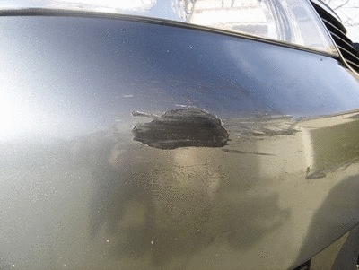
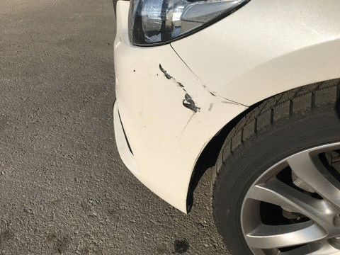
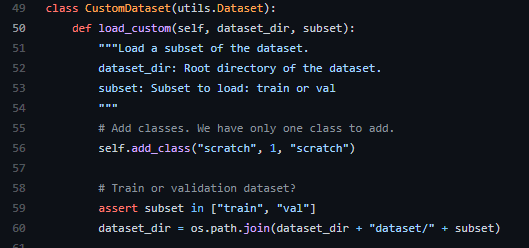
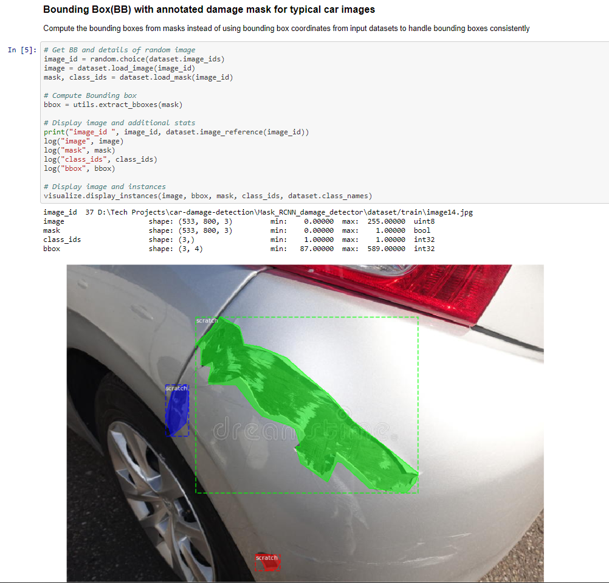
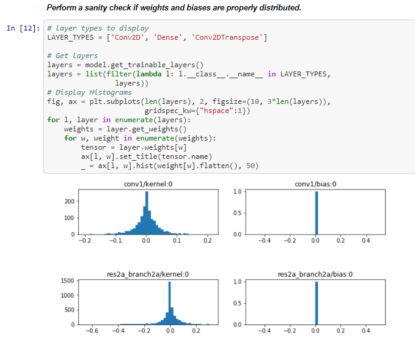
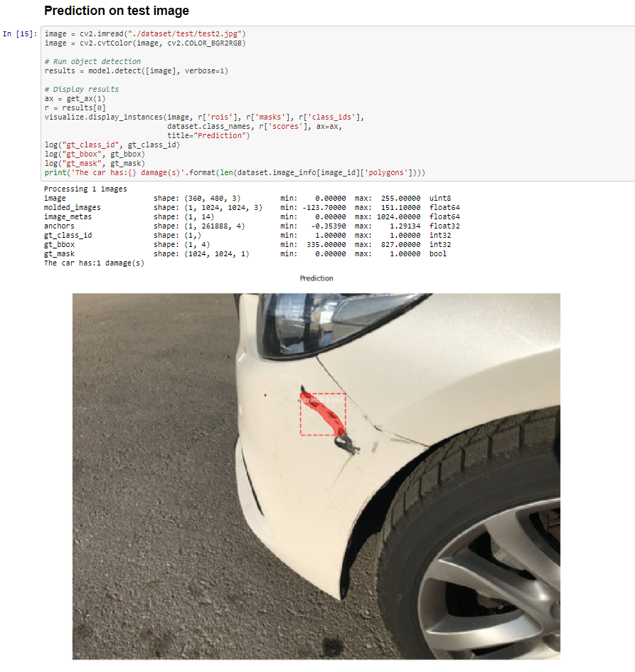

# Mask R-CNN for Car Damage Detection and Segmentation

This is an implementation of [Mask R-CNN](https://arxiv.org/abs/1703.06870) on Python 3, Keras, and TensorFlow. The model generates bounding boxes and segmentation masks for each instance of car in the image. It's based on Feature Pyramid Network (FPN) and a ResNet50/ResNet101 backbone.





# Aim
### To build a custom Mask R-CNN model that can detect the area of damage on a car.
The rationale for such a model is that it can be used by insurance companies for faster processing of claims if users can upload pics and they can assess damage from them. This model can also be used by lenders if they are underwriting a car loan especially for a used car.

# Mask R-CNN
### Mask R-CNN = Faster R-CNN and FCN (Fully Convolutional Network)
Mask R-CNN, extends Faster R-CNN by adding a branch for predicting an object mask in parallel with the existing branch for bounding box recognition. Mask R-CNN is an instance segmentation model that allows identifying pixel wise location for predefined class. Mask R-CNN is different from classical object detection models like Faster R-CNN where, in addition to identifying the class and its bounding box location, it can also color pixels in the bounding box that correspond to that class.


# How Mask R-CNN works
A detailed description of how Mask R-CNNN works in available at [How Mask R-CNN works](introduction.docx)  

# Step by Step Application of Convolutional neural networks (CNN) in Automated detection of car exterior damages and subsequent quantification(damage severity)
To help with debugging and understanding the model, [car-damage-detection.ipynb.ipynb](car-damage-detection.ipynb.ipynb) provides visualizations and allow running the model step by step to inspect the output at each point. Here are the explanations:


## 1. Data Collection
The dataset is made up of 68 images (50 train + 16 validation + 2 test) from the internet.

Sample Image 1             |   Sample Image 2
:-------------------------:|:-------------------------:
       |  

## 2. Data Annotation
A Mask R-CNN model requires the images in training dataset to be annotated, which is to have the region of damage in an image identified and the boundary of the damaged area marked accurately.
An example of annotation tool is the [VGG Image Annotator(VIA)](https://www.robots.ox.ac.uk/~vgg/software/via/via-1.0.6.html). The annotations is then saved as a json format file in the [dataset](/dataset) directory.

## 3. Import dataset and Visualization
This custom Mask R-CNN is built on top of [Matterport Mask R-CNN Github repository](https://github.com/matterport/Mask_RCNN).

Images and annotations from dataset will be loaded by the load_custom() function in CustomDataset Class.


Visualization of mask on the annotated image is done in [car-damage-detection.ipynb](car-damage-detection.ipynb)

   

   


## 4. Training model
Training and evaluation code is in `custom.py`.
The mask_rcnn_coco.h5, a pre-trained weights on coco dataset is used to train this model.

   

You can import this
module in Jupyter notebook (see the provided notebooks for examples) or you
can run it directly from the command line as such:

```
# Train a new model starting from pre-trained COCO weights
python custom.py train --dataset="D:/Tech Projects/car-damage-detection/Mask_RCNN_damage_detector/" --weights=coco

# Train a new model starting from ImageNet weights
python custom.py train --dataset="D:/Tech Projects/car-damage-detection/Mask_RCNN_damage_detector/" --weights=imagenet

# Continue training the last model you trained. This will find
# the last trained weights in the model directory.
python custom.py train --dataset="D:/Tech Projects/car-damage-detection/Mask_RCNN_damage_detector/" --weights=last
```

You can also run the COCO evaluation code with:
```
# Run COCO evaluation on the last trained model
python custom.py evaluate --dataset="D:/Tech Projects/car-damage-detection/Mask_RCNN_damage_detector/" --weights=last
```

The training schedule, learning rate, and other parameters should be set in `custom.py`.

## 5. Model Validation
The model weights is inspected in [car-damage-detection.ipynb.ipynb](car-damage-detection.ipynb.ipynb).Link last training checkpoint for model for validation. This step performs a sanity check if your weights and biases are properly distributed.
   

## 6. Prediction
Inspect model by performing prediction on test and validation to test the accuracy.
   

The repository includes:
* Source code of Mask R-CNN built on FPN and ResNet101.
* Training code for MS COCO
* Pre-trained weights for MS COCO
* Jupyter notebooks to visualize the detection pipeline at every step
* ParallelModel class for multi-GPU training
* Evaluation on MS COCO metrics (AP)
* Example of training on your own dataset

## Requirements
Python 3.7, TensorFlow 1.3, Keras 2.0.8 and other common packages listed in `requirements.txt`.

### MS COCO Requirements:
To train or test on MS COCO, you'll also need:
* pycocotools (installation instructions below)
* [MS COCO Dataset](http://cocodataset.org/#home)
* Download the 5K [minival](https://dl.dropboxusercontent.com/s/o43o90bna78omob/instances_minival2014.json.zip?dl=0)
  and the 35K [validation-minus-minival](https://dl.dropboxusercontent.com/s/s3tw5zcg7395368/instances_valminusminival2014.json.zip?dl=0)
  subsets. More details in the original [Faster R-CNN implementation](https://github.com/rbgirshick/py-faster-rcnn/blob/master/data/README.md).

If you use Docker, the code has been verified to work on
[this Docker container](https://hub.docker.com/r/waleedka/modern-deep-learning/).


## Installation
1. Clone this repository
2. Install dependencies
   ```bash
   pip3 install -r requirements.txt
   ```
3. Run setup from the repository root directory
    ```bash
    python3 setup.py install
    ```
4. Download pre-trained COCO weights (mask_rcnn_coco.h5) from the [releases page](https://github.com/matterport/Mask_RCNN/releases).
5. (Optional) To train or test on MS COCO install `pycocotools` from one of these repos. They are forks of the original pycocotools with fixes for Python3 and Windows (the official repo doesn't seem to be active anymore).

    * Linux: https://github.com/waleedka/coco
    * Windows: https://github.com/philferriere/cocoapi.
    You must have the Visual C++ 2015 build tools on your path (see the repo for additional details)
